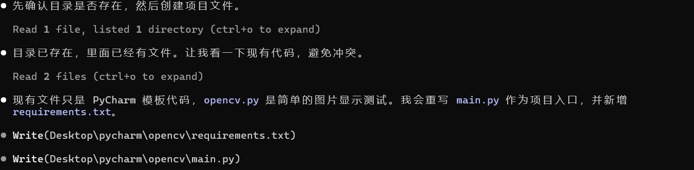
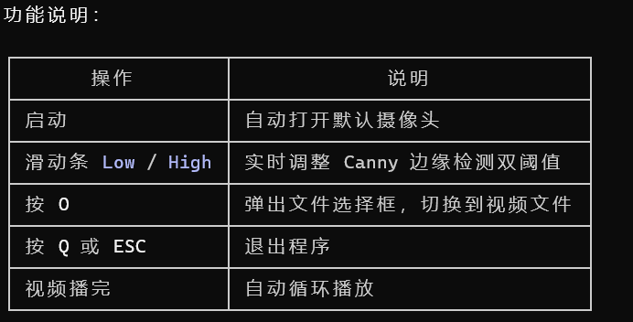
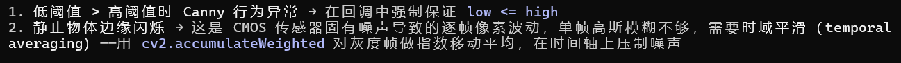
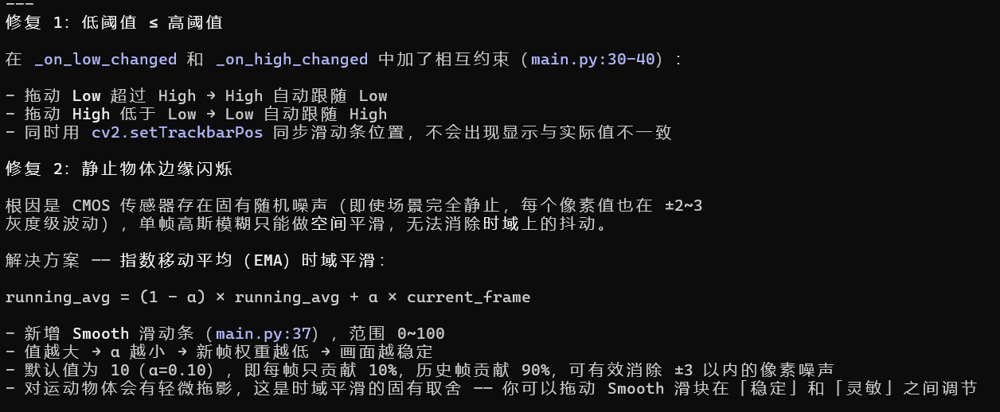
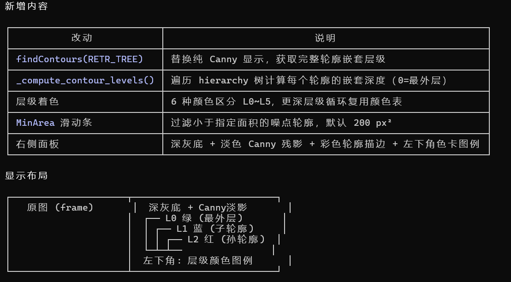
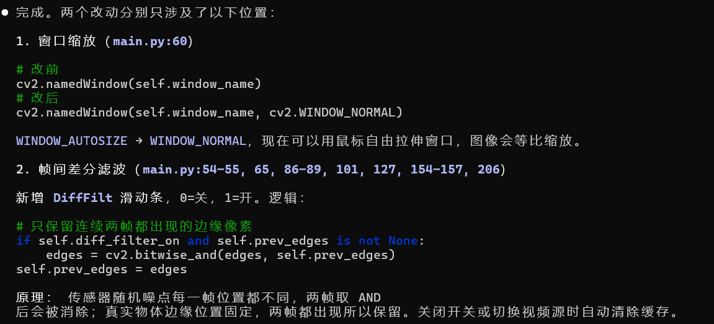
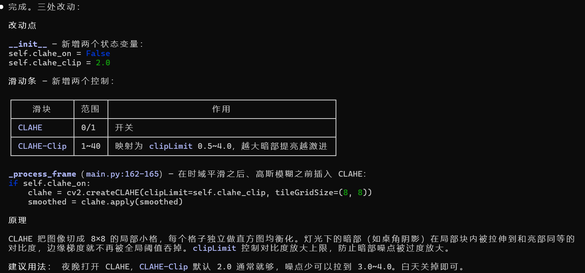

 >你是一位经验丰富的python和opencv工程师，请为我用python写一个机器人相关小工程，应用在pyhcarm上，内容包括：
 > 1.首先利用OpenCV读取摄像头或视频，按Q键退出
 > 2.其次实现实时边缘检测并显示结果
 > 3.窗口实时显现原始画面和边缘结果画面
 > 4.将输出代码存在main.py文件
 > 如果有什么问题直接问我，禁止胡编乱造如创建不存在API
 

> 目录创建在C:\Users\30205\Desktop\pycharm\opencv，这种交互方式可以，边缘检测canny算法
 

> 现在你的代码我认为有以下问题：1.在这个程序里面，并没有限制低阈值要小于高阈值
  2.在物品不动时边缘检测的结构若隐若现，排除电灯微小频率的干扰 请你根据我的问题进行更改

>代码结构没有问题，但是从结果来看轮廓的层次结构并未有显示，在原代码上进行改正
 

>好的，现通过对原代码修改增加两个新的应用：1.增加帧间滤波，消除静止画面随机闪烁噪点，提供开关，可开启关闭滤波
  2.支持窗口缩放，完善用户体验
  但是：1.只做最小改动，原有全部功能完整保留，不要删除、不要重构现有逻辑；不要全盘重写代码。
  2.只实现上面2项需求，禁止额外增加别的功能；有歧义再提问，不要无意义确认。

>在自然光条件下轮廓层次明显，但是夜晚在家庭灯光下检测不行，不考虑电灯频率的影响，在代码层面修改，有什么不确定直接询问
 

