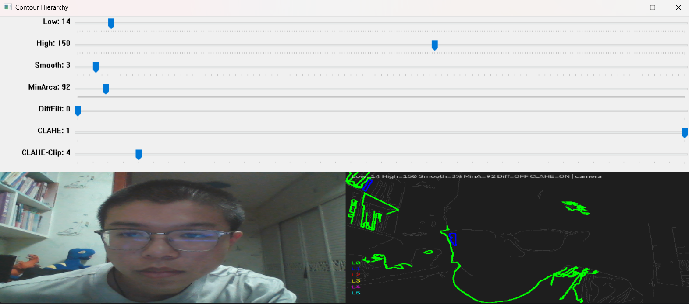

>提示词技巧：
    1.角色设定：“你是一位经验丰富的 python 和 opencv 工程师，请为我用 python 写一个机器人相关小工程”
                给 AI 划定身份、能力背景，输出风格贴合工程开发
    2.分布指令：编号列表，逐条枚举必须完成的功能，AI 不容易漏需求；方便后续核对交付结果。
    3.约束条件：“如果有什么问题直接问我，禁止胡编乱造创建不存在 API”，
                负向约束，明确禁止 AI 行为，限制它编造不存在函数。
                后面对代码进行改正时额外补充：“只做最小改动，原有全部功能完整保留，不要删除、不要重构现有逻辑；不要全盘重写代码。只实现上面 2 项需求，禁止额外增加别的功能；有歧义再提问，不要无意义确认。”
                防止ai大规模重写代码，提升效率
    4.迭代式分步指令：整个对话不是一次性写完完整项目，而是分多轮迭代：
                    首先基础功能，再进行debug，然后根据结果进行用户体验优化，一轮只精准解决一类问题。

>Debugging:
        现象描述式指令：“并没有限制低阈值要小于高阈值”
                描述客观现象，把问题交给 AI 分析根因，高效检索代码分析

>Refactor： 
        通过对现象的分析，指出并优化可视化窗口展示逻辑，优化画面显示布局，支持图像缩放查看，更符合实际情况
        通过夜晚电灯照耀下轮廓不明显情况，忽略电灯闪烁频率的设备问题，根据现象修改代码
>理解和修改：
        对于刚开始的代码结果，我发现实时边缘检测结果就算物体不动都时有时无，经过我对代码人工检查，发现原本的模糊选用中值模糊，但是实际情况中我认为会有很多平滑的物体，中值模糊可能会产生断层色块，产生失真，所以我改成了高斯模糊
