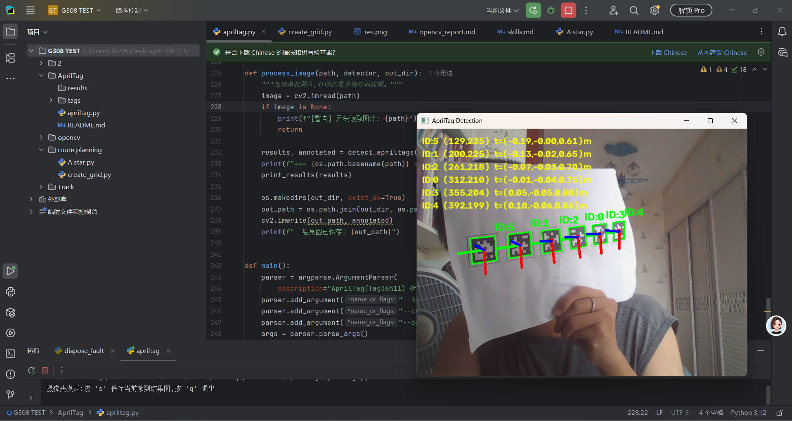
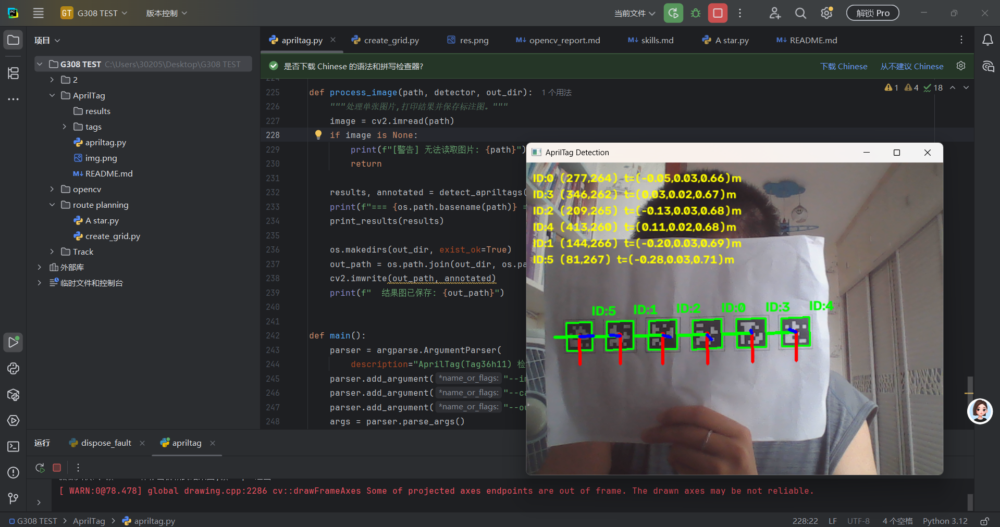
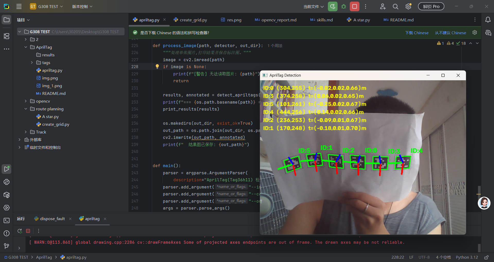
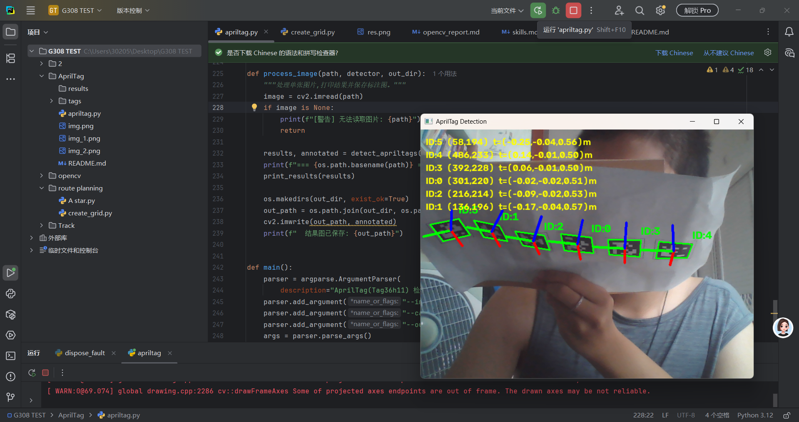

AprilTag 定位（Tag36h11）

源代码
apriltag.py —— 使用 OpenCV 内置 DICT_APRILTAG_36h11 字典实现 AprilTag 检测与位姿估计。输出每个 Tag 的 ID、中心像素坐标、平移向量 t、旋转矩阵 R 与欧拉角，并在图上绘制边框、ID 标签、中心点以及坐标轴（红=X、绿=Y、蓝=Z）。

测试图片及结果图
img.png、img_1.png、img_2.png、img_3.png —— 检测结果截图。
tags/ —— 可打印的 Tag36h11 图片（ID 0~5）。
results/ —— 程序输出的标注结果图目录。

运行说明
依赖：Python 3、opencv-python、numpy

运行：
python apriltag.py --image img.png   检测单张图片，结果图保存到 results/
python apriltag.py --camera          摄像头实时检测（按 s 保存当前帧，按 q 退出）

注：apriltag.py 顶部的 FX/FY/CX/CY 为相机内参，TAG_SIZE 为 Tag 实际边长（米），可按实际情况修改。

