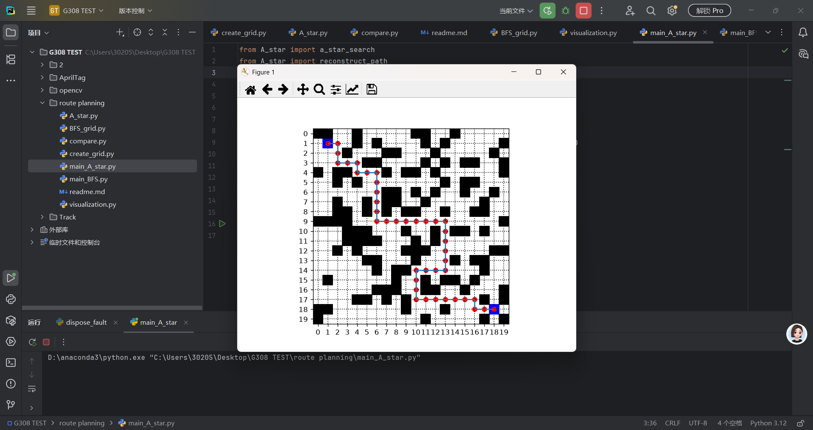
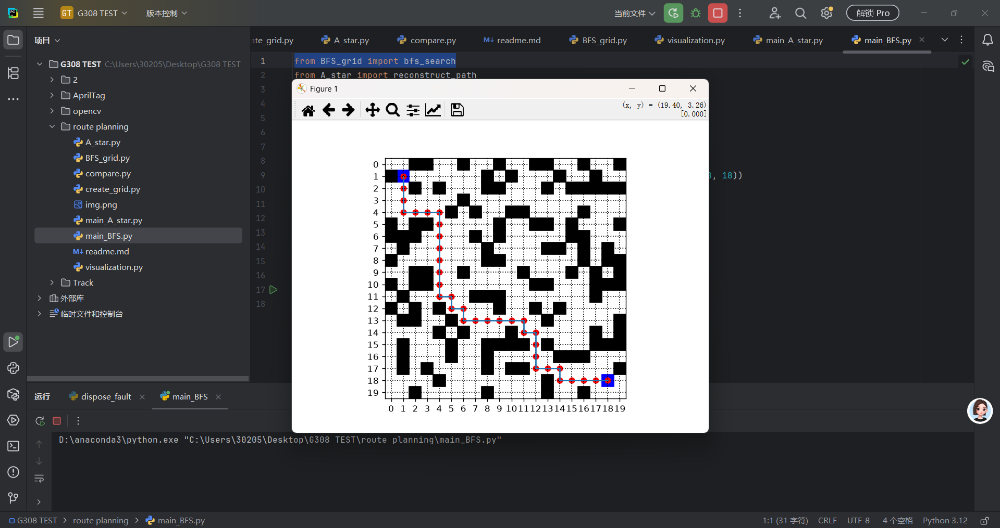
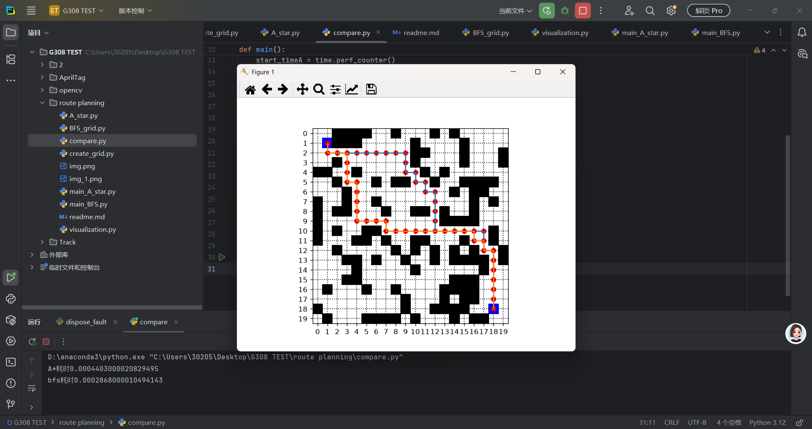

运行结果：
       A*：
       bfs：
       compare：

对比分析：
    1.这两种路径长度总体上来说是一样的，并没有什么绕路的现象。可以增大地图范围和格栅数目来判断两种算法是否能找到最短路径

2.搜索时间：A*：0.00044030
              bfs:0.00028680
             A*的搜索时间明显比bfs大，大约35%。在格栅数目和地图面积不大时，A*中单个 格子的判断计数的劣势大于减小扫描格子数目的优势，但这种差距会随着的地图的变大而减小，所以我认为在格栅足够多时，因为经历了更少的节点，A*是快于bfs的

3.这两种算法的时间复杂度的最坏情况是一样的，但是A*有启发函数，可以遍历更少的点，复杂度可能会低一些。因为 BFS 的队列是 deque，入队出队都是 O(1)；而 A* 的 PriorityQueue 每次插入/弹出是 O(log n)。所以 20×20 这种小图，A*虽然扩展的节点少，但每个节点的开销大，计时上可能不分上下甚至 BFS 略快——这不算 A* 差，只是问题规模太小，常数开销盖过了算法优势。这也能解释第二点时间长度的问题